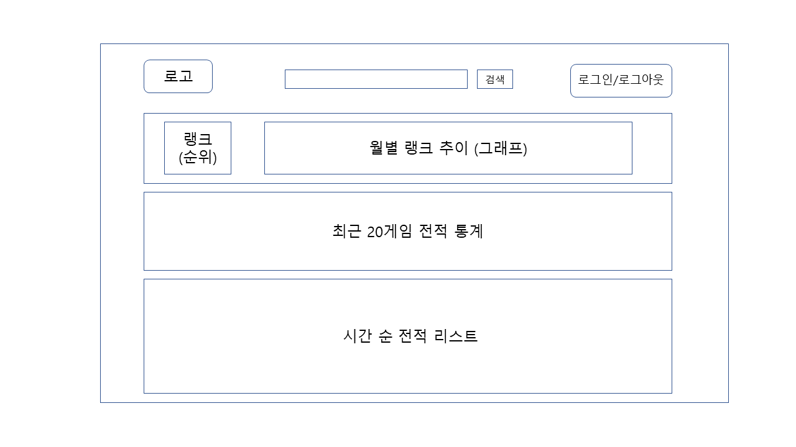

# 요구사항 정의서

## 기획

### 목차

1. 시스템 명, 시스템 개요
2. 필요한 기능
3. 메인 기능 요구사항
4. 반드시 필요한 기능과 추후 추가해도 되는 기능

### 1. 시스템 명, 시스템 개요

시스템 명 : 롤토체스(게임) 전적 검색 사이트

시스템 개요 : 롤토체스 유저를 위한 시스템으로, 유저 아이디를 기반으로 전적을 검색하여,
게임 정보와 유저의 게임 실력, 사용 전략, 타 유저 정보 등을 알아보고, 유저의 게임 성향 통계 등 다양한 정보를 제공한다.

### 2. 필요한 기능

1. 유저 아이디 검색
2. 유저 전적 보기
3. 실시간 상대 유저 전적 보기
4. 프로게이머 추천 전략 보기
5. 전략 정보 게시판

### 3. 메인 기능 요구사항

메인 기능 : 유저 전적 보기

1. 랭크 추이 : 시기별 유저 랭크 추이를 그래프로 확인한다.
2. 최근 게임 통계 : 최근 20개 게임의 결과를 통계로 간단하게 확인한다.
3. 매치 히스토리 : 시간 순서로 게임 결과를 리스트로 확인한다.
4. 플레이 스타일 통계 : 유저의 플레이 스타일 통계로 보기
5. 즐겨찾기 : 특정 전적 정보 즐겨찾기 추가/제거

### 4. 반드시 필요한 기능과 추후 추가해도 되는 기능

반드시 필요한 기능 : 랭크 추이, 최근 게임 통계, 매치 히스토리

추후 추가해도 되는 기능 : 플레이 스타일 통계, 즐겨찾기

## 설계

WireFrame :

