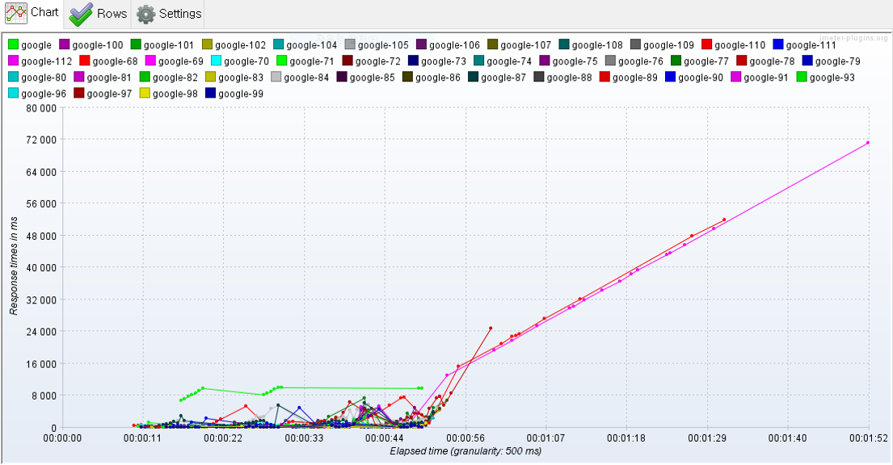
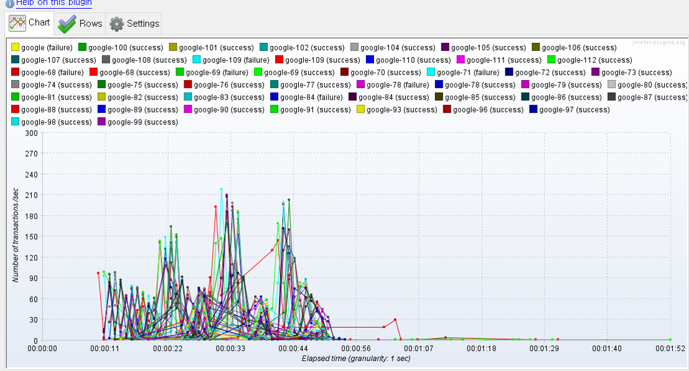

# Jmeter를 이용한 웹페이지 성능 측정 과제 안내
> :bulb: 우리가 만든 서비스는 몇명의 사용자의 접속을 견딜수 있을지 확인해 보기

## 성능 테스트 개념 정리

### 성능 테스트 용어 정리 

**트랜젠션**

- 화면 조작을 통한 Request발생~Response를 받기까지의 동작을 의미

**TPS**

- 1초에 처리할 수 있는 트랜젝션 수를 의미하며 성능 테스트의 중요한 지표

**응답시간**

- Request~최종화면 표시까지 걸리는 시간이며 영향을 주는 변수들이 많아 지표로서는 좋지 않으나, 사용자들이 직접 체감하는 지표이므로 같이 측정을 해 준다. 

### 성능 테스트 종류

1. **부하 테스트(Load Test)**
   - 목표 성능 도달 여부를 측정하기 위함(realse할때 사용)
   - 우리 사이트가 출결이면 최소 동시접속 80명까지는 가능해야 함
   - 성능 목표치는 요구사항에서 주어지며 이를 도달하지 못하면 도달을 위한 개선작업 필

2. **스파이크 테스트(Spike Test)**
   - 일시에 부하가 몰릴때 시스템이 버틸 수 있는지 체크
     - 수강신청 시스템처럼 일시에 부하가 몰릴것을 가정했을때, 이때 부하 가정 시나리오를 수강신청 모델을 사용한다.
   - 한계 성능 테스트

3. **신뢰성 테스트(Stress Testing)**
   - 한계 부하가 걸린 상태에서 시스템의 모든 기능들이 어느 정도 운용되는지 테스트 하는 것이며 이 결과는 SW품질 특성 중 '신뢰성'을 나타내는 지표로 활용됨
   
   - 미션 크리티컬한 시스템(예를 들어 비행기...또는 자동차 등등)에서는 필수적으로 받아야 하는 시스템이다. 

### 성능 테스트 수행 흐름

1. 사용자 프로파일 분석
2. 수행할 성능 테스트 종류 결정
3. 시스템 구조 분석
4. 시나리오 준비
5. 테스트 수행
6. 결과 분석

#### 성능 테스트 도구 

- 상용
  - Load Runner(Micro Focus)
- 오픈소스 [점유율비교](https://www.dotcom-tools.com/blog/best-open-source-load-testing-tools/)
  - Jmeter
    - 점유율 매우 높다!
  - nGrinder
    - Naver에서 Grinder를 베이스로 제작한 성능 테스트 툴. 
  - Locust

### Jmeter 다운로드 및 설치

[jmeter설치](https://jmeter.apache.org/download_jmeter.cgi)

[jmeter-plugins설치](https://jmeter-plugins.org/install/Install/)

- 다운받아서 jmeter 디렉터리안에 lib/ext밑에 파일을 복사해야 한다. 
- 3 basic graph, jpge-standard set 설치

[참고](https://soul0.tistory.com/279)

### 프로젝트 수행 안내

간단한 구조로 진행

- Jmeter Server-Client같은 구조를 사용하지 않습니다.
- 본인 PC에서 수행함. 

가급적 Jmeter 버전은 5.x로 진행

- Ulimate Thread Group이용

성능 측정은 1학기때 수행한 관통 프로젝트 중 가장 많은 트랜잭션이 발생할 것 같은 페이지(또는 기능) 하나를 선정하여 한계 성능을 측정함. 

## 성능 테스트(예시)

### Test1. 

- 100유저부터 10초에 20유저씩 증가시켜 한계 성능 측정

#### Response Time

#### TPS(Transactions per Second)

#### 

#### Result

* Response Time이 44초 이후에 급격하게 증가하여 이 시점을 전후하여 한계 부하가 온 것으로 파악됨
* TPS 그래프에서 44초 이후 TPS는 급격하게 줄어듬. 대략 180TPS정도를 찍고 다운된 것으로 보여 이 시스템의 한계 부하는 **180TPS** 로 파악됨.  

## 과제제출
- [기본과제](기본과제) : 기본과제 README.md 파일에 과제 수행 결과 작성
